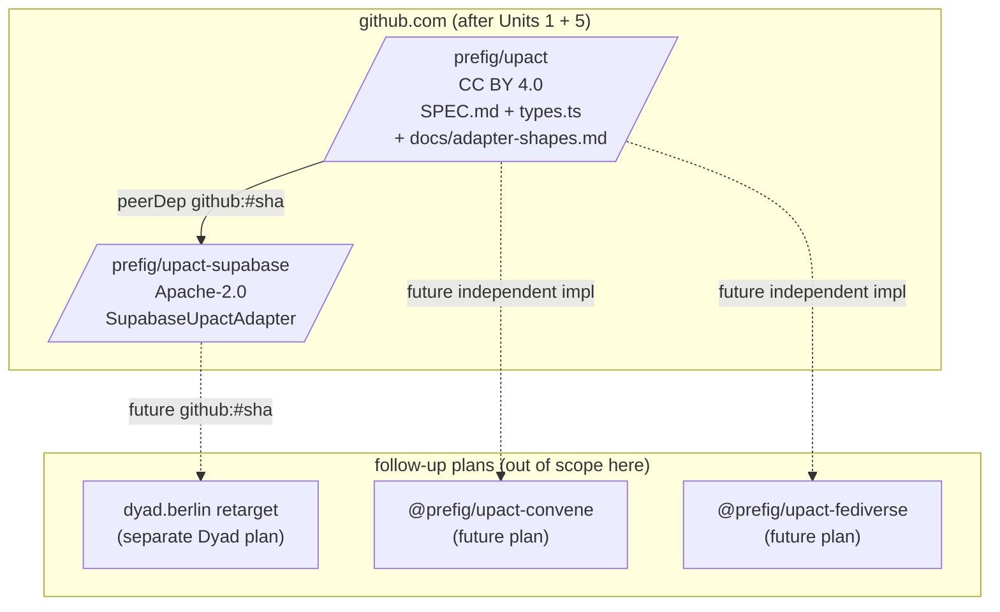

# feat: ship upact v0.1 — spec, types, and Supabase reference adapter

## Target repos

This plan spans three repos. Each implementation unit names its target.

- **`prefig/upact`** — local: `~/prefig/upact/` — the spec + reference types (CC BY 4.0). Already drafted; needs to be pushed public.
- **`prefig/upact-supabase`** — local: `~/prefig/upact-supabase/` — the adapter package (Apache-2.0). Scaffolded; implementation lifts from Dyad's `refactor/identity-service` branch.
- **`dyad.berlin`** — local: `~/dyad.berlin/` — the reference application (AGPL-3.0). Existing branch `refactor/identity-service` retargets to import the adapter.

File paths in each unit are repo-relative to the target repo named in that unit.

## Overview

This plan ships **upact v0.1** — a coherent contribution composed of three artefacts:

1. The upact port specification (drafted at `~/prefig/upact/SPEC.md`, CC BY 4.0).
2. The reference TypeScript types (drafted at `~/prefig/upact/src/types.ts`, CC BY 4.0).
3. The first reference adapter, `@prefig/upact-supabase` — this plan implements it (Apache-2.0).

The Supabase adapter demonstrates the *port + adapters* pattern: an anti-corruption layer that wraps a substrate, strips fields the port forbids, exposes capabilities, and returns `UserIdentity`. Future adapters (`@prefig/upact-convene` for presence-renewed identity, a fediverse adapter for DID-shaped identity, etc.) will implement the same port independently against substrates with different lifecycles and threat models. To validate that this Supabase adapter's design choices don't silently substrate-shape the upact namespace, type-only sketches for Convene-shaped and fediverse-shaped adapters live alongside the spec at `~/prefig/upact/docs/adapter-shapes.md`. Only the Supabase instance is implemented here.

Dyad's adoption of the adapter and its separate admin-role-migration work are scoped to follow-up Dyad-internal plans, not part of this plan. The adapter ships as a public artefact in time for the 2026-05-01 OSA submission narrative; Dyad's consumption follows.

## Problem Frame

The OSA review of Convene v0 (`convene/.context/compound-engineering/ce-review/20260430-135135-cfea42df/`) surfaced that the OS contribution should be the **upact** — the architectural contract — rather than Convene specifically. The synthesis at `~/prefig/rebuild/docs/2026-04-30-identity-port-pattern.md` reframes the contribution as *port + adapters*, with the adapter being the anti-corruption layer in code: each adapter wraps a substrate, strips fields the port forbids, exposes capabilities, and returns `UserIdentity` per the spec.

The upact spec (`~/prefig/upact/SPEC.md` v0.1-draft) and reference types (`~/prefig/upact/src/types.ts`) are drafted. The adapter package (`~/prefig/upact-supabase/`) is scaffolded but has no implementation. Dyad's existing `refactor/identity-service` branch (commit `bdcc549`) has the kernel of the implementation — `identityFromUser(user: User)` and `requireIdentity(locals)` — but its `UserIdentity` shape (`{ id, email?, metadata? }`) doesn't match the port's (`{ id, display_hint?, lifecycle, capabilities }`) and the code lives inside Dyad rather than in a reusable, permissively-licensed package.

The work is **lifting that kernel out, conforming it to the port, adding the operations the existing kernel doesn't yet cover (`authenticate`, `invalidate`, `issueRenewal`), and publishing the result as a public Apache-2.0 package**. Channel-bound operations like `EmailChannel` are deferred to v0.2 per upact §5.3 (channel ops are explicitly outside the spec's scope). Dyad's adoption of the adapter and the related role-storage migration are scoped to follow-up plans (see Sources & References).

(See origin: `~/prefig/rebuild/docs/2026-04-30-identity-port-pattern.md` and `~/prefig/upact/SPEC.md`.)

## Requirements Trace

- **R1.** `@prefig/upact-supabase` exports a `SupabaseUpactAdapter` class that implements upact `IdentityPort` per SPEC §6 (`authenticate`, `currentIdentity`, `invalidate`, `issueRenewal`).
- **R2.** Adapter strips PII per upact §7 — no email, phone, IP, `app_metadata`, JWT claims, `confirmed_at`, `last_sign_in_at`, or any `user_metadata` field beyond the optional `display_hint`.
- **R3.** Adapter returns capability set `{ email, recovery }` for Supabase users with an email; `{}` otherwise. Capabilities derive from substrate inspection, not configuration.
- **R4.** *Deferred to v0.2.* Channel-bound operations such as `EmailChannel` are scoped out of v0.1 per upact §5.3 (channel operations are outside the spec's scope). The adapter declares the `email` and `recovery` capabilities (R3); a future consumer that needs to email a user by `identity.id` will drive the channel design at that point.
- **R5.** Adapter is unit-tested (vitest) for all four port operations plus the capability mapper and identity mapper, with PII-stripping assertions explicit.
- **R6.** Both prefig packages (`@prefig/upact`, `@prefig/upact-supabase`) are pushed to public GitHub repos with tagged v0.1.0-draft commits, so a consuming application can depend on them via `github:` URLs without npm publishing.
- **R11.** `prefig/upact-supabase/README.md` includes a conformance statement per upact §10: declares conformance to upact v0.1-draft, lists self-declared capabilities (`email`, `recovery`), names the substrate (Supabase Auth), names the threat model (low-to-medium-stakes coordination, per upact §11), and lists any SHOULD-clause deviations (none expected for v0.1).
- **R12.** `~/prefig/upact/docs/adapter-shapes.md` exists in the upact repo before push, sketching Convene-shaped and fediverse-shaped adapters in type-only form. It validates that this plan's Supabase-adapter design choices do not silently substrate-shape the upact namespace (see "Cross-adapter validation" under Key Technical Decisions).

*(R7–R10 from earlier drafts of this plan have been moved to a follow-up Dyad-internal plan; see Sources & References.)*

## Scope Boundaries

**In scope:**
- Implementing all four `IdentityPort` operations on the adapter, even where Dyad does not consume them today (`authenticate`, `invalidate` — Dyad's auth flows currently bypass these via direct Supabase calls). Required by upact SPEC §3 for the adapter to be a conforming provider; a partial implementation would not be citable as a conforming adapter in the OSA narrative.
- Adding `~/prefig/upact/docs/adapter-shapes.md` to the upact repo (type-only sketches of Convene-shaped + fediverse-shaped adapters) before pushing upact public.

**Out of scope:**
- Retargeting Dyad to consume `@prefig/upact-supabase` (the *demonstration* of port adoption). Follow-up Dyad plan, sequenced after this plan ships and the adapter package is public.
- Migrating Dyad's admin role storage out of `auth.users.app_metadata.role`. Follow-up Dyad-internal plan, independent of this plan's adapter work.
- Implementing channel-bound operations (`EmailChannel` and equivalents). Deferred to v0.2 per upact §5.3 (channel operations are explicitly outside the spec's scope).
- Migrating Dyad's auth flows (login, signup, magic-link, password reset in `src/routes/(auth)/`) to call `adapter.authenticate(credential)` instead of `supabase.auth.*` directly. Follow-up plan.
- Implementing other reference adapters (`@prefig/upact-oidc`, `@prefig/upact-did`, `@prefig/upact-convene`). The adapter-shapes sketch in `~/prefig/upact/docs/adapter-shapes.md` is *forward-looking documentation only* — no implementations.
- Wiring `@prefig/upact-convene` into Dyad as a second provider behind the port. This is Phase 2b of the OSA implementation plan (separate work).
- npm publishing. Both packages stay on `github:` URLs through v0.1.0-draft. npm publishing is a follow-up once the spec is more stable.
- Writing a conformance test suite for the upact spec (deferred to v0.2 per upact §10).

## Context & Research

### Relevant Code and Patterns

**`prefig/upact-supabase/`** (target repo, scaffolded only):
- `package.json` — peerDeps `@prefig/upact ^0.1.0-draft` and `@supabase/supabase-js ^2.0.0`. Apache-2.0. `main: ./src/index.ts`.
- `src/index.ts` — placeholder, currently `export {};` with a roadmap comment.
- `tsconfig.json` — strict mode, ES2022, `noUncheckedIndexedAccess`, `declaration: true`.
- No `tests/` directory yet; no vitest config; no `vitest`/`tsx` devDeps.

**`prefig/upact/`** (target repo, drafted):
- `SPEC.md` v0.1-draft (260 lines, normative).
- `src/types.ts` — `UserIdentity`, `IdentityLifecycle`, `Session` (branded opaque type), `AuthError`, `IdentityPort`, `IdentityDecayAware`, `Capability` (union with `string & {}` extension).
- `package.json` — `"@prefig/upact"` v0.1.0-draft, CC BY 4.0, `main: ./src/types.ts`.

**`dyad.berlin/` on `refactor/identity-service`** (kernel to lift):
- `src/lib/services/identity.ts` — `identityFromUser(user: User): UserIdentity` and `requireIdentity(locals: App.Locals): UserIdentity`. 45 lines.
- `src/lib/services/identity.test.ts` — 7 tests (vitest) covering happy paths, PII stripping, copy-not-reference for metadata, 401 throw.
- `src/lib/server/auth.ts` — `requireAuth(user: User | null): User` throws 401 via SvelteKit's `error()`. Used by `requireIdentity`.
- 30 files import `requireIdentity` (handlers in `routes/api/`, `routes/(app)/`, `routes/(admin)/`, `routes/(editor)/`).
- `src/lib/server/load-layout-data.ts:17` calls `identityFromUser(locals.user)` and at line 42 reads `locals.user?.app_metadata?.role === 'admin'` — the latter explicitly commented as "deliberately outside the identity view."
- `src/routes/api/invites/+server.ts:24` reads `locals.user.app_metadata?.role !== 'admin'` directly via a local `requireAdmin` helper.
- `identity.email` has **zero non-test reads** in app code. The migration off `email` requires no call-site changes outside `identity.ts` itself and its test file.
- `src/lib/server/email.ts` — `sendEmail(to, subject, html)`. Called with explicit recipient strings from domain rows (waitlist `contact.email`, invitation `invitation.email`), never via `identity.email`. Out of scope for `EmailChannel` migration in v0.1.

**`prefig/rebuild/convene/`** (pattern to mirror for prefig packages):
- `package.json` has `"scripts": { "test": "vitest run", "test:watch": "vitest" }`, devDeps `vitest ^1.0.0`, `tsx ^4.0.0`, `typescript ^5.0.0`, `@types/node ^20.0.0`.
- `tests/` directory (mirrors `src/`) with `*.test.ts` files; vitest auto-discovers.
- `src/index.ts` re-exports public surface; subpath exports declared in `package.json` `exports` map for sub-modules (e.g. `./registry/server`).
- Convene is AGPL-3.0; upact-supabase is Apache-2.0 (already correct in scaffold).

**Cloudflare Pages constraint:**
- `dyad.berlin/package.json` declares `@sveltejs/adapter-cloudflare ^7.2.5`. Cloudflare Pages runs `npm install` then `npm run build` in a clean container. `github:org/repo#sha` URLs resolve via GitHub's tarball API — no `git` binary required at build time. peerDeps auto-install since npm 7. This is the pivotal property that makes the linking strategy work.

### Institutional Learnings

- `~/dyad.berlin/docs/solutions/architecture/sovereignty-lessons-learned.md` §4 — same anti-corruption-layer principle applied to the SQL layer (`app.current_user_id()`). The identity port is the application-layer expression of the same shape; the existing identity.ts JSDoc references this.
- `~/dyad.berlin/docs/plans/2026-04-18-001-refactor-shared-infra-foundations-plan.md` (M2 plan) — the existing IdentityService work that produced the `refactor/identity-service` branch. This plan extends and supersedes M2 by retargeting the kernel into the prefig org.

### External References

- upact SPEC.md §6 (operations), §7 (privacy minima MUST NOT clauses), §10 (provider conformance statement). At `~/prefig/upact/SPEC.md`.
- DDD anti-corruption layer (Evans 2003) — referenced in `2026-04-30-identity-port-pattern.md`.

### Slack context

Not gathered. The user did not request it; no Slack tools were dispatched.

## Key Technical Decisions

- **Linking strategy: `github:` URLs with pinned commit SHAs.** Both `@prefig/upact` and `@prefig/upact-supabase` are pushed to public GitHub repos. Consuming applications depend on `github:prefig/upact#<sha>` and `github:prefig/upact-supabase#<sha>`. **Rationale:** preserves the "adapter lives in its own repo" architectural decision; lets consumers pin to a known-good commit while the adapter is pre-1.0; survives bundlers like Cloudflare Pages without restructure (npm 7+ resolves `github:` URLs via the GitHub tarball API and auto-installs peerDeps). Decided in /ce:plan 2026-04-30.
- **Cross-adapter validation via type-only sketches.** Before pushing `@prefig/upact` public, add `~/prefig/upact/docs/adapter-shapes.md` with type-only sketches of Convene-shaped and fediverse-shaped adapters. **Rationale:** the Supabase adapter is the first conforming implementation; its design choices set precedent unless explicitly checked. The sketches force the abstraction to face a second instance before the first ships, surfacing which choices are Supabase-specific (request-bound substrate client at construction; sync `userToIdentity` mapper; service-role admin lookup; `recovery`–`email` capability coupling) and ruling them out as cross-adapter conventions. Cost: ~1 hour. Decided in /document-review 2026-04-30.
- **`display_hint` sourced from `user_metadata.display_name` only.** When absent, `display_hint` is `undefined` and consumers fall back to their own rendering. **Rationale:** matches upact §4.2 ("best-effort string the application MAY render"); never derives from email or any substrate identifier; predictable; consistent with upact §7.1.
- **All four port operations implemented in v0.1, even where no current consumer exercises them.** Spec conformance per upact §3 requires the adapter to expose `authenticate`, `currentIdentity`, `invalidate`, and `issueRenewal`. The first three may not be called by Dyad's existing flows for some time; `currentIdentity` is the only operation a consuming app needs to read identities. **Rationale:** a partial implementation would not be citable as a conforming adapter in the OSA narrative.
- **Channel-bound operations deferred to v0.2.** No `EmailChannel` (or other channels) ship in v0.1. **Rationale:** upact §5.3 explicitly scopes channel operations *outside* the spec's scope; the adapter declares the `email` and `recovery` capabilities (R3) and lets a future consumer drive the channel design. Avoids speculative complexity (no current consumer; design has open questions about admin-client privileges and error semantics that only a real consumer can answer). Decided in /document-review 2026-04-30.
- **`recovery` capability bound to `email` capability for Supabase.** Supabase recovery is email-based. Adapter emits `{ email, recovery }` together when `user.email` is set, `{}` otherwise. **Rationale:** honest about the substrate; documented in `adapter-shapes.md` as a Supabase-specific coupling that does *not* generalise (Convene has no recovery; fediverse recovery is cryptographic).
- **`Session` opacity preserved via type branding.** upact §7.4 requires `Session` to be opaque. The reference types use `unique symbol` branding; the adapter constructs `Session` values internally and never exposes substrate-shaped session structures.
- **`issueRenewal(identity, evidence)` ignores `evidence` for Supabase.** Supabase's `refreshSession()` reads the refresh token from cookies on the request-bound client. Documented as substrate-specific behaviour; conforming because the spec leaves `evidence` shape per-provider.

## Open Questions

### Resolved During Planning

- **Linking strategy** → `github:` URLs with pinned SHAs (see Key Technical Decisions).
- **Internal `@prefig/upact-supabase` ↔ `@prefig/upact` link** → same `github:` URL; resolved when the prefig repos exist on GitHub.
- **Backward-compat path for downstream consumers** → no deprecated-field shim; consumers retarget to the upact-shaped `UserIdentity` directly. Email-call-site count on Dyad's `refactor/identity-service` is zero (verified via `git grep`); the retarget is a no-op at the call-site level for that consumer.
- **Tests location** → `prefig/upact-supabase/tests/` mirroring `prefig/rebuild/convene/tests/`. Vitest auto-discovery.
- **`Session` opacity** → `unique symbol`-branded type; adapter never exposes Supabase `Session`.
- **`issueRenewal` shape for Supabase** → `evidence: unknown` is unused; refresh token read from cookies.
- **Display hint source** → `user_metadata.display_name` only; undefined fallback.
- **Phase B (Dyad consumption + role migration)** → split into separate follow-up Dyad plan(s); not in this plan's scope. Decided in /document-review 2026-04-30.
- **EmailChannel** → deferred to v0.2 per upact §5.3. v0.1 declares `email` + `recovery` capabilities only; no channel implementation. Decided in /document-review 2026-04-30.
- **Cross-adapter compatibility validation** → addressed via type-only sketches at `~/prefig/upact/docs/adapter-shapes.md` (Convene-shaped + fediverse-shaped adapters). Decided in /document-review 2026-04-30.

### Deferred to Implementation

- **GitHub org provisioning.** The `prefig` GitHub org may not exist yet under Theodore's account. Options: create it, push to a personal namespace (`tjdcevans/upact`, etc.), or use an existing org. Resolved by inspection at the start of Unit 1.
- **Exact commit SHAs for the github-URL pins.** Decided when Units 1 and 5 push, by capturing the pushed commit SHAs.
- **vitest version.** Convene uses `vitest ^1.0.0`. The adapter is independent — pick `^1.0.0` for parity with the convene precedent unless tooling requires a newer version. Resolved when adding the devDep in Unit 4.

## High-Level Technical Design

> *This illustrates the intended approach and is directional guidance for review, not implementation specification. The implementing agent should treat it as context, not code to reproduce.*

### Cross-repo dependency graph



### Adapter shape

```ts
// prefig/upact-supabase/src/adapter.ts — directional sketch, not final code
class SupabaseUpactAdapter implements IdentityPort {
  constructor(private supabase: SupabaseClient) {}

  // §6.1 — credential shape is provider-defined; for Supabase, password+email
  // or magic-link OTP. Returns an opaque branded Session.
  async authenticate(credential): Promise<Session | AuthError> { ... }

  // §6.2 — request-bound supabase client reads cookies internally;
  // `_request` is unused on this adapter (substrate-allowed).
  async currentIdentity(_request): Promise<UserIdentity | null> {
    const { data: { user } } = await this.supabase.auth.getUser();
    return user ? userToIdentity(user) : null;
  }

  // §6.3 — calls supabase.auth.signOut(); session value is opaque-branded.
  async invalidate(session): Promise<void> { ... }

  // §6.4 — Supabase substrate ignores `evidence` (refresh token read from cookies).
  async issueRenewal(identity, _evidence): Promise<UserIdentity | null> { ... }
}

// Pure mapper: User → UserIdentity, with PII stripped per §7
function userToIdentity(user: User): UserIdentity {
  return {
    id: user.id,
    display_hint: nonEmptyString(user.user_metadata?.display_name),
    lifecycle: { issued_at: user.created_at, renewable: 'reauth' },
    capabilities: capabilitiesFromUser(user)  // {email, recovery} | {}
  };
}
```

### Capability decision matrix

| Substrate state | Capabilities returned |
|---|---|
| `user.email` present | `{ 'email', 'recovery' }` |
| `user.email` absent | `{}` |

(For Dyad's existing Supabase configuration, the second row is unreachable — every account has email. The mapping is honest about the substrate's behaviour.)

## Implementation Units

**Prerequisite (complete):** both `~/prefig/upact/` and `~/prefig/upact-supabase/` are tracked as their own git repos with an initial commit (`upact` 9bb7d7e, `upact-supabase` d88c0d8). Convene's history extraction from `prefig/rebuild` is deferred and is not part of this plan's scope.

Six units, all OSA-critical (the spec push, adapter implementation, tests, packaging, public adapter push, cross-references). Sequencing is roughly linear; Unit 6 can land at the end.

- [ ] **Unit 1: Add adapter-shapes sketch to upact, push @prefig/upact to GitHub**

**Target repo:** `prefig/upact` (local: `~/prefig/upact/`)

**Goal:** (a) Add `docs/adapter-shapes.md` to the upact repo with type-only sketches of Convene-shaped and fediverse-shaped adapters, validating that this plan's Supabase-adapter design choices don't silently substrate-shape the upact namespace. (b) Make the upact spec, reference types, and adapter-shapes sketch publicly resolvable via a `github:` URL so `@prefig/upact-supabase`'s peerDep can be pinned and the OSA submission can cite the public URL.

**Requirements:** R6, R12.

**Dependencies:** prefig GitHub org exists or fallback namespace decided.

**Files:**
- Create: `docs/adapter-shapes.md` — type-only sketches per R12. *(Already drafted at `~/prefig/upact/docs/adapter-shapes.md` during /document-review 2026-04-30; review and confirm before pushing.)*
- Modify: `package.json` (verify `repository.url` matches the actual pushed URL; update if a fallback namespace is used).
- Modify: `README.md` (drop any "internal draft" language; confirm v0.1.0-draft framing; add a brief link to `docs/adapter-shapes.md`).

**Approach:**
- Review and finalise the adapter-shapes sketch, ensuring the three substrate comparisons are accurate per current upact spec language and the Convene v0 spec.
- Resolve GitHub org provisioning. Default: create `github.com/prefig` org under Theodore's account. Fallback: push to `github.com/tjdcevans/upact` and update `repository.url` accordingly.
- Stage the new docs file with `git add docs/adapter-shapes.md`, commit, push to the resolved namespace, tag `v0.1.0-draft`.
- Capture the commit SHA — this is the pin for `@prefig/upact-supabase`'s peerDep and for downstream consumers' `package.json` files.

**Patterns to follow:**
- Convene's repo layout (`prefig/rebuild/convene/`) for what a published prefig package looks like, with the licence-difference noted (upact is CC BY 4.0; Convene is AGPL-3.0).

**Test scenarios:**
- Test expectation: none — repo provisioning has no behavioural change. Verification is operational (the URL resolves, the tag exists, `npm view github:<namespace>/upact` succeeds).

**Verification:**
- `https://github.com/<namespace>/upact` is publicly accessible and shows `SPEC.md`, `src/types.ts`, and `docs/adapter-shapes.md`.
- The v0.1.0-draft tag exists on the pushed commit.
- `npm install github:<namespace>/upact#<sha>` in a scratch directory succeeds and produces a `node_modules/@prefig/upact/src/types.ts`.
- The adapter-shapes sketch is referenced from the upact README so a fresh visitor can find it.

---

- [ ] **Unit 2: Implement SupabaseUpactAdapter (port operations + capability mapper)**

**Target repo:** `prefig/upact-supabase` (local: `~/prefig/upact-supabase/`)

**Goal:** Lift the kernel of `dyad.berlin/src/lib/services/identity.ts` into a class that implements `IdentityPort` and conforms to upact §6 + §7.

**Requirements:** R1, R2, R3.

**Dependencies:** Unit 1 complete (peerDep `@prefig/upact` resolvable).

**Files:**
- Create: `src/adapter.ts` — `SupabaseUpactAdapter` class implementing `IdentityPort`.
- Create: `src/capabilities.ts` — pure `capabilitiesFromUser(user: User): ReadonlySet<Capability>` mapper.
- Create: `src/identity-mapper.ts` — pure `userToIdentity(user: User): UserIdentity` mapper.

**Approach:**
- Adapter is a **per-request object.** Constructor takes a request-bound `SupabaseClient` (cookies bound at construction — e.g. SvelteKit's `event.locals.supabase`). Module-singleton instantiation is incorrect because the SupabaseClient itself binds cookies. The `request: Request` parameter on `currentIdentity` is unused on this adapter (cookies already bound) — substrate-allowed by upact §6.2.
- **Credential discriminator (`authenticate`):** define a tagged union `type SupabaseCredential = { kind: 'password'; email: string; password: string } | { kind: 'otp'; email: string }`. The adapter narrows on `kind` and dispatches to `signInWithPassword` or `signInWithOtp`. Any value that does not match — including a missing `kind`, a wrong `kind`, malformed structure, or non-object input — returns `AuthError({ code: 'invalid_credential', message: 'unrecognised credential shape' })` without calling Supabase. Substrate error responses from Supabase are normalised to a fixed set of `AuthError.code` values (e.g. `'invalid_grant'`, `'rate_limited'`, `'network'`); raw substrate error text is not propagated to callers.
- `authenticate(credential)` returns a `Session` value or `AuthError`. The `Session` value MUST be runtime-opaque, not just brand-tagged: the adapter wraps the substrate session inside a class with no enumerable substrate-shaped properties and an overridden `toJSON()` that returns an opaque token. Casts and `JSON.stringify(session)` MUST NOT expose substrate JWT claims (`sub`, `email`, `aud`, `exp`, etc.).
- `currentIdentity(request)` calls `supabase.auth.getUser()`. Returns `null` when no user.
- `invalidate(session)` calls `supabase.auth.signOut()`; the session value is opaque-branded and the adapter does not re-extract substrate fields from it.
- `issueRenewal(identity, _evidence)` calls `supabase.auth.refreshSession()`; on success, fetches the refreshed user and returns a fresh `UserIdentity`. Returns `null` on failure. **Important substrate-specific behaviour:** both `identity` and `evidence` are *unused* on this adapter — `refreshSession()` acts on the cookie-bound client regardless of which `identity` is passed. This is conforming because the spec leaves `evidence` per-provider, but it means the operation SHOULD only be called by the application in an explicit renewal context (sliding-window middleware, scheduled refresh) — not on every request. Documented in the conformance statement (Unit 4).
- `userToIdentity` builds `{ id, display_hint?, lifecycle: { issued_at: user.created_at, renewable: 'reauth' }, capabilities }`. `display_hint` is the result of a non-empty-string check on `user.user_metadata?.display_name`; otherwise omitted.
- `capabilitiesFromUser` returns a frozen `ReadonlySet<Capability>` containing `email` and `recovery` iff `user.email` is a non-empty string; else an empty frozen set.
- No fields beyond the mapper's output are added to `UserIdentity`. PII stripping is enforced by *not constructing* the field, not by deleting it after construction. The mapper's return value uses a plain object literal with no prototype properties, no getters, and no Symbol-keyed fields — so `JSON.stringify(userIdentity)` and `Object.keys(userIdentity)` agree on the public surface.

**Patterns to follow:**
- `dyad.berlin` (`refactor/identity-service` branch) `src/lib/services/identity.ts` — the existing `identityFromUser` is the template for `userToIdentity`. The "metadata is a copy not a reference" property (existing test on the Dyad branch) carries over implicitly because we don't copy `user_metadata` at all.

**Test scenarios:** Covered in Unit 3. Implement against the test scenarios listed there.

**Verification:**
- `tsc --noEmit` passes.
- `src/adapter.ts` does not import any field-by-field destructure of `User` beyond the substrate fields the mapper explicitly reads (`id`, `email`, `created_at`, `user_metadata?.display_name`).

---

- [ ] **Unit 3: Adapter unit tests (vitest)**

**Target repo:** `prefig/upact-supabase` (local: `~/prefig/upact-supabase/`)

**Goal:** Conformance + correctness coverage for the four port operations, the capability mapper, and the identity mapper. Lifts and adapts the existing 7 Dyad tests; adds new tests for operations the Dyad branch doesn't yet cover.

**Requirements:** R5.

**Dependencies:** Unit 2.

**Files:**
- Create: `tests/identity-mapper.test.ts` — pure `userToIdentity` tests.
- Create: `tests/capabilities.test.ts` — pure `capabilitiesFromUser` tests.
- Create: `tests/adapter.test.ts` — adapter operation tests with a mocked `SupabaseClient`.
- Create: `tests/fixtures/user.ts` — `makeUser(overrides)` helper, lifted from `dyad.berlin/src/lib/services/identity.test.ts`.

**Approach:**
- Mock `SupabaseClient` minimally (the adapter calls a small surface: `auth.getUser`, `auth.signInWithPassword`, `auth.signInWithOtp`, `auth.signOut`, `auth.refreshSession`). A typed test-double object is sufficient; no `vitest.mock` factory machinery needed.

**Patterns to follow:**
- `prefig/rebuild/convene/tests/derive.test.ts` — pure-function vitest style.
- `dyad.berlin/src/lib/services/identity.test.ts` (`refactor/identity-service` branch) — the makeUser helper, the PII-stripping assertion idiom, and the copy-not-reference test all carry over directly.

**Test scenarios:**

For `userToIdentity` (`tests/identity-mapper.test.ts`):
- *Happy path:* user with id, email, `user_metadata.display_name` → `UserIdentity` has `id`, `display_hint`, lifecycle `{issued_at: user.created_at, renewable: 'reauth'}`, capabilities `{email, recovery}`.
- *Edge case:* user with no email → capabilities is empty set, no `display_hint` fallback derived from email.
- *Edge case:* user with email but no `user_metadata.display_name` → `display_hint` is `undefined` (key absent or undefined; not present).
- *Edge case:* user with empty-string `user_metadata.display_name` → `display_hint` is `undefined` (empty strings rejected).
- *Privacy assertion (keys):* output object has no `app_metadata`, `aud`, `role`, `confirmed_at`, `last_sign_in_at`, `email`, `phone`, `identities`, `updated_at` keys (assert `Object.keys(identity)` is exactly `['id', 'display_hint', 'lifecycle', 'capabilities']` or `['id', 'lifecycle', 'capabilities']` when `display_hint` absent).
- *Privacy assertion (serialisation surface):* `JSON.stringify(identity)` yields a string containing only the four allowed fields' content — no substrate keys, no JWT claims, no `app_metadata`, no email, no phone. Catches non-enumerable properties, getters, prototype pollution, and Symbol-keyed fields that `Object.keys` misses. (Capability `ReadonlySet` serialises to `{}` by default; assert against the expected stringified shape with capabilities replaced by `Array.from(identity.capabilities)`.)
- *Privacy assertion:* output `lifecycle` has only `issued_at` and `renewable` keys; no `expires_at` for Supabase's `'reauth'` substrate.

For `capabilitiesFromUser` (`tests/capabilities.test.ts`):
- *Happy path:* user with email → `Set(['email', 'recovery'])`.
- *Edge case:* user without email → empty `Set`.
- *Edge case:* user with empty-string email → empty `Set`.
- *Returns frozen / readonly set:* attempting `add` on the returned set throws or has no effect.

For `SupabaseUpactAdapter` (`tests/adapter.test.ts`):
- *Happy path — currentIdentity:* mocked client returns a user → adapter returns a `UserIdentity` matching the mapper's output.
- *Happy path — currentIdentity (no user):* mocked client returns `{ data: { user: null } }` → adapter returns `null`.
- *Privacy assertion — currentIdentity:* mocked client returns a user with `app_metadata` and JWT-shaped fields → adapter's return value has none of them; `JSON.stringify` of the result contains none of those keys.
- *Happy path — authenticate (password):* credential `{ kind: 'password', email, password }` → adapter calls `signInWithPassword` and returns a `Session`-shaped value.
- *Happy path — authenticate (OTP):* credential `{ kind: 'otp', email }` → adapter calls `signInWithOtp` and returns a `Session`-shaped value.
- *Error path — authenticate (malformed):* credentials `null`, `'a string'`, `{}`, `{ email: 'a' }` (missing kind), `{ kind: 'unknown' }` → adapter returns `AuthError({ code: 'invalid_credential', ... })`. The mocked client's `signInWithPassword` and `signInWithOtp` are NOT called for any of these (verified via spy).
- *Error path — authenticate (substrate failure):* mocked client returns a Supabase auth error → adapter returns `AuthError` with a normalised `code` value (e.g. `'invalid_grant'`, `'rate_limited'`); raw substrate error text MUST NOT appear in the returned `message`.
- *Privacy assertion — Session opacity:* the value returned from `authenticate` is wrapped such that `JSON.stringify(session)` produces an opaque token (or empty `{}`), NOT a JSON object containing JWT claims (`sub`, `email`, `aud`, `exp`). Casting via `as any` and inspecting properties exposes nothing substrate-shaped.
- *Happy path — invalidate:* adapter calls `signOut`; resolves to `void`.
- *Happy path — issueRenewal:* mocked client returns refreshed user → adapter returns a fresh `UserIdentity` (verified by `lifecycle.issued_at` consistency or via spy on `getUser`).
- *Edge case — issueRenewal failure:* refresh fails → adapter returns `null`.
- *Substrate-specific behaviour — issueRenewal ignores identity/evidence:* call `issueRenewal(arbitraryIdentity, arbitraryEvidence)` where `arbitraryIdentity.id` is NOT the cookie-bound user's id; adapter still calls `refreshSession()` and returns the cookie-holder's renewed identity. Documents that the operation acts on the request, not the passed identity. (This is the conforming-but-substrate-specific behaviour documented in Key Technical Decisions.)
- *Integration — currentIdentity preserves PII boundary across calls:* call twice with different mocked users; each returned `UserIdentity` independently passes the privacy assertion (both `Object.keys` and `JSON.stringify` checks).

**Verification:**
- `npm test` runs vitest and all scenarios pass.
- All tests run in well under a second (no real network).

---

- [ ] **Unit 4: Wire the adapter package (config, exports, README conformance)**

**Target repo:** `prefig/upact-supabase` (local: `~/prefig/upact-supabase/`)

**Goal:** Make the package buildable, testable, and importable. Add the conformance statement (upact §10) to the README.

**Requirements:** R5, R11, R6 prep.

**Dependencies:** Units 2, 3.

**Files:**
- Modify: `package.json` — add `scripts.test`, `scripts.test:watch`, devDeps `vitest`, `tsx`. Update peerDep `@prefig/upact` to a `github:` URL pinned to Unit 1's commit SHA. Keep all exports flat from `.` (matches Convene's precedent and avoids subpath-export gymnastics now that EmailChannel is deferred).
- Modify: `src/index.ts` — re-exports: (a) the class `SupabaseUpactAdapter`; (b) the sync helpers `userToIdentity` and `capabilitiesFromUser` (Supabase-substrate convenience per `~/prefig/upact/docs/adapter-shapes.md` — exported so consumers whose substrate populates a User object synchronously, e.g. SvelteKit hooks placing `event.locals.user`, can keep their `requireIdentity`-style wrappers sync); (c) the credential type `SupabaseCredential` (the tagged-union from Unit 2); (d) type re-exports from `@prefig/upact` for consumer convenience (`UserIdentity`, `Capability`, `Session`, `AuthError`, `IdentityLifecycle`).
- Create: `vitest.config.ts` if needed (Convene gets by without one; vitest auto-discovery on `tests/**/*.test.ts` may suffice).
- Modify: `README.md` — add a "Conformance statement" section per upact §10:
  - Declares conformance to upact v0.1-draft.
  - Lists self-declared capabilities (`email`, `recovery`); notes the Supabase-substrate-specific coupling (recovery is bound to email; not generalisable — see `~/prefig/upact/docs/adapter-shapes.md`).
  - Names the substrate (Supabase Auth) and the threat model ("low-to-medium-stakes coordination; substrate's leakiness is acceptable in exchange for simplicity" — per upact §11).
  - Names SHOULD-clause deviations (none expected for v0.1).
  - Notes that channel-bound operations are deferred to v0.2 per upact §5.3.
  - **Documents `issueRenewal` substrate-specific behaviour** — both `identity` and `evidence` parameters are unused; the operation refreshes whichever identity owns the request cookies. Applications SHOULD only call this in an explicit renewal context (sliding-window middleware, scheduled refresh), not on every request.
  - **Documents `display_hint` provenance** — sourced from `user_metadata.display_name`, which is application-writable in Supabase. The application is responsible for sanitising or overriding display hints if it cares about impersonation prevention; the adapter passes through whatever Supabase has.
  - **Install instructions show SHA-pinned URLs** — `npm install github:<namespace>/upact-supabase#<commit-sha>`, NOT `#v0.1.0-draft`. Tags are mutable and offer no supply-chain guarantee; SHAs are content-addressed. Include a one-line note explaining this.

**Approach:**
- Mirror Convene's `package.json` shape for `scripts` and devDeps.
- Update peerDep version range with a comment explaining the github URL pin.
- README conformance section is short — copy structure from upact §10's checklist.

**Patterns to follow:**
- `prefig/rebuild/convene/package.json` — vitest scripts, devDep versions, exports map shape.

**Test scenarios:**
- Test expectation: behavioural coverage lives in Unit 3. This unit's verification is structural.
- *Smoke:* `npm install` succeeds with the new devDeps.
- *Smoke:* `npm test` runs and all Unit 3 tests pass.
- *Smoke:* `tsc --noEmit` passes (declarations build cleanly).
- *Pre-flight peerDep check (BEFORE Unit 5 push):* in a scratch project elsewhere on disk, run `npm install file:../upact-supabase` (or `npm pack` + tarball-pin) with `@prefig/upact` peerDep set to `file:../upact`. Confirm `npm install` resolves the peerDep without error and that `import { SupabaseUpactAdapter, userToIdentity } from '@prefig/upact-supabase'` type-checks. **Reason:** npm has historically had quirks with `github:`-URL peerDeps (a semver-range string like `^0.1.0-draft` does not match a github tarball); confirming the resolution chain works locally with `file:` URLs catches the issue before any public push.

**Verification:**
- `npm install && npm test && npx tsc --noEmit` all succeed.
- The pre-flight peerDep check above passes in a scratch project.
- Importing the package in a scratch project resolves the `SupabaseUpactAdapter` symbol, the sync `userToIdentity` and `capabilitiesFromUser` helpers, and the re-exported types from `@prefig/upact`.

---

- [ ] **Unit 5: Push @prefig/upact-supabase to GitHub**

**Target repo:** `prefig/upact-supabase` (local: `~/prefig/upact-supabase/`)

**Goal:** Make the adapter publicly resolvable via a `github:` URL so consuming applications (Dyad first, others later) can pin to it.

**Requirements:** R6.

**Dependencies:** Unit 4 complete (package builds and tests pass).

**Files:**
- Modify: `package.json` — confirm `repository.url` matches the actual pushed namespace.

**Approach:**
- The local repo already has an initial commit (`d88c0d8`); add the implementation commits and push to `github.com/<namespace>/upact-supabase`, tag `v0.1.0-draft`.
- Capture the commit SHA — this is the pin for downstream consumers' `package.json` files (Dyad will use it in the follow-up Dyad plan).
- Verify the GitHub repo's README renders correctly and links to the upact spec public URL (Unit 1) and to `docs/adapter-shapes.md`.

**Patterns to follow:**
- Same as Unit 1.

**Test scenarios:**
- Test expectation: none — repo provisioning. Verification is operational.

**Verification:**
- `https://github.com/<namespace>/upact-supabase` is publicly accessible.
- `npm install github:<namespace>/upact-supabase#<sha>` in a scratch project succeeds; `npm install` also resolves the peerDep `@prefig/upact` from its github URL automatically (npm 7+ behaviour).
- `import { SupabaseUpactAdapter } from '@prefig/upact-supabase'` type-checks in a scratch project.
- This is the definitive proof-point for the `github:` URL strategy on standard npm. (Production-build verification on Cloudflare Pages migrates to the follow-up Dyad plan that will actually consume the URL there.)

---

- [ ] **Unit 6: Update cross-references**

**Target repo:** `prefig/rebuild` (local: `~/prefig/rebuild/`) and others.

**Goal:** Update planning docs and READMEs to reflect that the upact spec, types, and Supabase reference adapter are now public.

**Requirements:** Narrative coherence; not a functional requirement.

**Dependencies:** Units 1–5 complete.

**Files:**
- Modify: `~/prefig/rebuild/docs/plans/2026-04-30-osa-and-convene-implementation-plan.md` — Phase 1a/1b: mark as complete with links to the public prefig repos and to this plan. Note that Phase 2 (Dyad as port-shaped reference application) becomes its own follow-up Dyad plan rather than continuing inline here.
- Modify: `~/prefig/upact-supabase/README.md` — drop the "Implementation pending" status note; replace with v0.1.0-draft completion language and links to the public spec and the adapter-shapes sketch.
- Modify: `~/prefig/upact/README.md` — add a "First reference adapter" pointer to `@prefig/upact-supabase` and a link to `docs/adapter-shapes.md`.
- Optionally: draft a paragraph for the OSA submission narrative citing the three public artefacts. Consumer of this plan; not part of its scope.

**Approach:**
- Documentation edits only. Land them after Unit 5 is public.

**Test scenarios:**
- Test expectation: none — documentation-only changes with no behavioural impact.

**Verification:**
- All cross-reference links resolve to live URLs or correct file paths.

## System-Wide Impact

This plan ships a *new* public package + adds a docs file to the existing upact repo. There is no production data touched and no consumer wired in this plan.

- **Interaction graph (new):** `@prefig/upact-supabase` exports `SupabaseUpactAdapter` as the single seam between a consuming app and Supabase Auth. Future consumers (Dyad first, others later) instantiate the adapter once per request and call its port operations. No existing production code depends on this package today.
- **Error propagation:** the adapter exposes `AuthError` per upact §6 (a typed value, not an exception) for `authenticate` failures. Other operations return `null` on missing/expired identity. Consumers handle the union type at the call site. No exception-throwing semantics introduced.
- **API surface:** a fresh public surface — `SupabaseUpactAdapter` plus re-exported types from `@prefig/upact`. No legacy parity to maintain.
- **No production data touched:** the plan creates two public repo states and one docs file; no SQL migrations, no backfills, no production database state changes.
- **Cloudflare Pages compatibility (verified later, when a consumer integrates):** Unit 5's verification step confirms `npm install github:<namespace>/upact-supabase#<sha>` resolves in a clean scratch project on standard npm 7+. Production-build verification on Cloudflare Pages happens in the follow-up Dyad plan that actually consumes the URL there. Risk-managed via `github:` URL pinning + tarball API resolution, which Cloudflare's npm install supports natively.
- **Deferred decisions documented:** channel-bound operations (`EmailChannel`-shaped) are explicitly scoped out of v0.1 per upact §5.3; no consumer touches them. The first real consumer drives the v0.2 design.

## Risks & Dependencies

| Risk | Mitigation |
|------|------------|
| `npm install github:<namespace>/upact-supabase#<sha>` fails or auto-install of peerDeps misbehaves on standard npm. | Unit 4 includes a pre-flight `file:`-URL test in a scratch project that catches peerDep resolution issues before any public push. Unit 5's verification confirms the same with `github:` URLs after the push. If the github-URL path fails, options are: list both packages as direct deps (no peerDep), or include a tarball check-in. |
| Consumer uses tag-pinned URL (`#v0.1.0-draft`) instead of SHA-pinned. | Tags are mutable; a GitHub-account compromise lets an attacker repoint the tag to a malicious commit while leaving the SHA-pinned package.json fields elsewhere untouched. Mitigation: Unit 4's README install example shows the SHA-pinned form (`#<sha>`) explicitly, with a one-line note that tag URLs offer no supply-chain guarantee. The adapter's own `peerDep` URL is SHA-pinned; consumers SHOULD do the same. |
| `prefig` GitHub org doesn't exist and Theodore can't create it before the OSA submission window. | Fallback namespace decided at the start of Unit 1: push to a personal namespace (e.g. `tjdcevans/upact`) and update `repository.url` + the peerDep URL accordingly. The npm package names `@prefig/...` stay consistent regardless of the GitHub namespace. |
| Adapter-shapes sketch (R12) understates substrate-specific risk in a way that lets the Supabase adapter quietly set bad precedent. | The sketch is reviewable independently before push. Unit 1 includes a "review and finalise" step for the sketch. After v0.1 ships, when a real second adapter is implemented, any divergence between the sketch's predictions and the real adapter's needs surfaces a v0.2 spec-or-doc update — cheap to make at draft stage. |
| Cloudflare Pages production builds (in the follow-up Dyad plan) reveal that `github:` URLs don't resolve there or that peerDep auto-install fails. | The follow-up Dyad plan owns this verification. If it fails there, the fallback (committed tarballs, or eventually npm publish) is straightforward — the package itself is unchanged. This plan does not block on Cloudflare-specific verification. |
| Shipping `upact-supabase` v0.1.0-draft publicly creates a backward-compat constraint when Convene ships next month and forces a spec change. | `github:` URL pinning means consumers stay on the v0.1.0-draft commit until they explicitly upgrade. Spec breakage between v0.1 and v0.2 is permitted (per upact SPEC.md §12). The constraint is on *Theodore's coordination*, not on consumers; the adapter-shapes sketch (R12) reduces this risk by surfacing variation up front. |
| All four port operations are tested in isolation but only `currentIdentity` is exercised by a real consumer. The shapes of `authenticate`/`AuthError`/`issueRenewal`/`evidence` may need v0.2 breaks once a real consumer arrives. | Acceptable for v0.1. The adapter is a draft; spec breakage between v0.1 and v0.2 is permitted. First real consumer drives the refinement. |

## Documentation / Operational Notes

- The OSA submission narrative (per `~/prefig/rebuild/docs/2026-04-30-identity-port-pattern.md`) cites three artefacts: the upact spec (CC BY 4.0), the upact reference types (CC BY 4.0), and the upact-supabase adapter (Apache-2.0). All three are public after this plan completes. The adapter-shapes sketch (R12) is a fourth supporting artefact that demonstrates the spec is not Supabase-specific.
- The conformance statement in `prefig/upact-supabase/README.md` (added in Unit 4) is the artefact upact §10 requires from any conforming provider.
- No production data is touched. Rollback: revert the public commits and tags on the two prefig repos. No consumer is wired in this plan, so there is no production impact to roll back.
- Follow-up plans owned elsewhere:
  - **Dyad consumption** (Dyad imports `@prefig/upact-supabase`, retargets `requireIdentity`): scoped to a Dyad-internal plan, sequenced after Unit 5 of this plan.
  - **Dyad admin-role migration** (admin storage moves out of `app_metadata`): independent Dyad-internal plan; can run in parallel with the consumption plan.
  - **Auth-flow migration** (Dyad's login/signup/magic-link/password-reset routed through `adapter.authenticate`): later Dyad-internal plan; depends on the consumption plan.
  - **EmailChannel implementation** (v0.2): driven by the first real consumer that needs to email a user by `identity.id`.
  - **Convene + fediverse adapter implementations**: their own plans, against the same port; the adapter-shapes sketch (R12) is forward-looking documentation, not implementation.

## Sources & References

- **Origin document:** `~/prefig/rebuild/docs/2026-04-30-identity-port-pattern.md`
- **upact spec:** `~/prefig/upact/SPEC.md` (v0.1-draft, ~260 lines)
- **upact reference types:** `~/prefig/upact/src/types.ts`
- **Adapter-shapes sketch (R12):** `~/prefig/upact/docs/adapter-shapes.md` *(drafted during /document-review 2026-04-30; reviewed and pushed in Unit 1)*
- **Existing kernel to lift in Unit 2:** `dyad.berlin` `refactor/identity-service` branch — `src/lib/services/identity.ts` (commit `bdcc549`)
- **Existing tests to adapt in Unit 3:** `dyad.berlin` `refactor/identity-service` branch — `src/lib/services/identity.test.ts`
- **Pattern to mirror for prefig packages:** `prefig/rebuild/convene/`
- **OSA implementation plan (parent — Phase 1a/1b):** `~/prefig/rebuild/docs/plans/2026-04-30-osa-and-convene-implementation-plan.md`
- **M2 plan (predecessor for the existing identity kernel):** `~/dyad.berlin/docs/plans/2026-04-18-001-refactor-shared-infra-foundations-plan.md`

### Follow-up plans (Dyad consumption — out of scope for this plan)

These plans are scoped to the Dyad repo, not the prefig org, and run after this plan's Unit 5 publishes the adapter. They are listed here so the trail is followable from this plan's "Out of scope" section:

- **Dyad adopts `@prefig/upact-supabase`:** TBD — to live at `~/dyad.berlin/docs/plans/2026-05-XX-NNN-feat-adopt-upact-supabase-plan.md`. Imports the adapter via `github:` URL pin, retargets `requireIdentity` to return upact-shaped `UserIdentity`, drops local `UserIdentity` shape, and verifies the Cloudflare Pages production build with the github-URL deps. Consumes the work this plan ships.
- **Dyad admin-role storage migration:** TBD — to live at `~/dyad.berlin/docs/plans/2026-05-XX-NNN-fix-admin-role-out-of-app-metadata-plan.md`. SQL migration, isAdmin helper, lint rule. Independent of the upact work; can run in parallel with the consumption plan.
